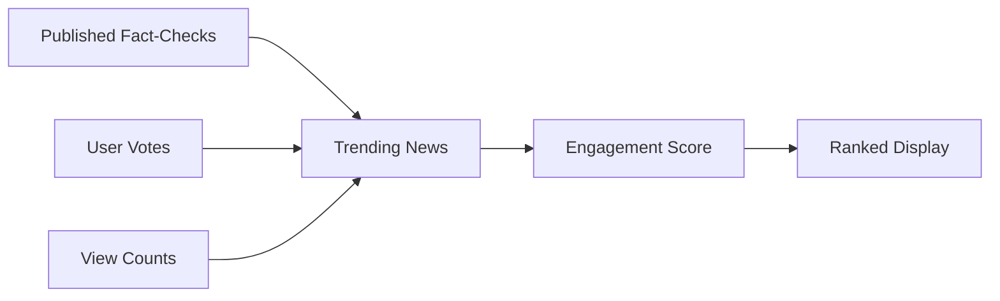
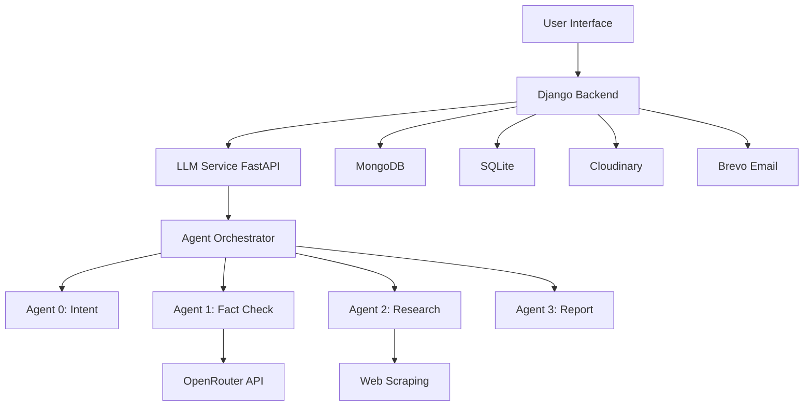

<div align="center">

# 🌟 SatyaMatrix AI

### *Truth in the Age of Misinformation*

[](https://www.python.org/)
[](https://www.djangoproject.com/)
[](https://fastapi.tiangolo.com/)
[](https://www.mongodb.com/)
[](LICENSE)

**An AI-powered fact-checking platform that combats misinformation through intelligent verification, real-time analysis, and community engagement.**

[Features](#-features) • [Architecture](#-architecture) • [Tech Stack](#-tech-stack) • [Key Components](#-key-components) • [Demo](#-demo)

</div>

---

## 🎯 Overview

SatyaMatrix is a next-generation fact-checking platform that leverages advanced AI agents to verify claims, detect misinformation, and provide transparent, source-backed analysis. Built with a multi-agent architecture, it intelligently distinguishes between casual conversations and fact-check requests, delivering accurate results in real-time.

---

## ✨ Features

### 🤖 **Intelligent AI Agents**

<table>
<tr>
<td width="50%">

#### **Agent 0: Intent Classifier**
- Distinguishes fact-check requests from general chat
- Confidence-based routing system
- Natural language understanding

</td>
<td width="50%">

#### **Agent 1: Fact Checker**
- Multi-source verification
- Confidence scoring (🟢🟡🔴)
- Evidence-based analysis

</td>
</tr>
<tr>
<td width="50%">

#### **Agent 2: Web Researcher**
- Real-time web scraping
- Source credibility assessment
- Citation management

</td>
<td width="50%">

#### **Agent 3: Report Generator**
- Structured fact-check reports
- Visual confidence indicators
- Downloadable reports

</td>
</tr>
</table>

---

### 💬 **Smart Chat Interface**

```
┌─────────────────────────────────────────────────┐
│  🎨 Beautiful, Modern UI                        │
│  ⚡ Real-time message streaming                 │
│  📎 Multi-file upload support                   │
│  💾 Conversation history & management           │
│  🔍 Searchable chat archives                    │
│  📱 Fully responsive design                     │
└─────────────────────────────────────────────────┘
```

---

### 📊 **Trending News Dashboard**

<div align="center">



</div>

**Features:**
- 🔥 Real-time trending news feed
- 👍👎 Community voting system
- ✅ Fact-check status badges
- 📈 Engagement-based ranking
- 🔄 Auto-refresh every 5 minutes
- 🌐 3D globe visualization

---

### 📧 **Email Notification System**

Powered by **Brevo (Sendinblue)** for reliable email delivery:

- 📨 Automated fact-check report emails
- 🎨 Beautiful HTML email templates
- 📬 Bulk email support for announcements
- ✉️ User alert preferences
- 🔔 Real-time notification system

---

### 🗄️ **Data Management**

#### **Dual Database Architecture**

```
┌──────────────┐         ┌──────────────┐
│   SQLite     │         │   MongoDB    │
│              │         │              │
│ • Users      │         │ • Messages   │
│ • Auth       │         │ • Chats      │
│ • Profiles   │         │ • News       │
└──────────────┘         └──────────────┘
```

- **SQLite**: User authentication & profiles
- **MongoDB**: Chat history, messages, trending news
- **Cloudinary**: Media file storage & CDN

---

## 🏗️ Architecture

<div align="center">



</div>

---

## 🛠️ Tech Stack

### **Frontend**
- 🎨 **HTML5/CSS3** - Modern, responsive design
- ⚡ **Vanilla JavaScript** - Fast, lightweight interactions
- 🌈 **Custom CSS** - Beautiful gradients & animations
- 🎬 **Three.js** - 3D globe visualization

### **Backend**
- 🐍 **Django 5.2** - Robust web framework
- ⚡ **FastAPI** - High-performance LLM service
- 🔐 **Django Auth** - Secure authentication
- 📡 **RESTful APIs** - Clean, scalable endpoints

### **AI & ML**
- 🤖 **OpenRouter API** - Multi-model AI access
- 🧠 **Custom Agent System** - Specialized AI agents
- 📊 **Confidence Scoring** - Reliability metrics
- 🔍 **Web Scraping** - Real-time data collection

### **Databases**
- 🗄️ **MongoDB Atlas** - Scalable NoSQL database
- 💾 **SQLite** - Lightweight relational database
- ☁️ **Cloudinary** - Media storage & CDN

### **Services**
- 📧 **Brevo (Sendinblue)** - Email delivery
- 🌐 **OpenRouter** - AI model routing
- 🔗 **REST APIs** - External integrations

---

## 🔑 Key Components

### 1️⃣ **Multi-Agent System**

The heart of SatyaMatrix is its intelligent agent orchestration:

```python
Agent 0 (Intent) → Classifies user input
    ↓
    ├─→ Chat Mode → OpenRouter API → Conversational response
    │
    └─→ Fact-Check Mode → Agent 1 → Verification pipeline
                              ↓
                         Agent 2 → Web research
                              ↓
                         Agent 3 → Report generation
```

### 2️⃣ **Fact-Check Pipeline**

```
User Query → Intent Detection → Source Research → 
Verification → Confidence Scoring → Report Generation → 
Email Notification → Trending News
```

### 3️⃣ **Trending News System**

- **Auto-Population**: Published fact-checks automatically become trending news
- **Engagement Scoring**: `(likes × 2) + views - (dislikes × 0.5)`
- **Status Badges**: Visual indicators for verification status
- **Community Interaction**: Vote and engage with news items

### 4️⃣ **Chat Management**

- **Conversation Tracking**: Each chat session is stored with unique ID
- **Message History**: Full conversation retrieval and search
- **File Uploads**: Support for images, videos, documents
- **Real-time Updates**: Instant message delivery

---

## 🎨 UI Highlights

### **Landing Page**
- Stunning video background with Aurora effects
- Smooth animations and transitions
- Clear call-to-action buttons
- Responsive grid layout

### **Chat Interface**
- Clean, modern message bubbles
- Avatar-based sender identification
- Inline action buttons (Publish, Download)
- Floating input with file attachment

### **Trending Dashboard**
- NASA-inspired mission control design
- 3D rotating globe with location tracking
- Real-time statistics and charts
- Interactive news cards with voting

### **Profile Management**
- User preferences and settings
- Email/SMS alert toggles
- Account information display
- Secure logout functionality

---

## 📦 Project Structure

```
404__found_us/
├── llm/                          # LLM Service (FastAPI)
│   ├── app/
│   │   ├── agents/              # AI Agent implementations
│   │   │   ├── intent.py        # Agent 0: Intent classification
│   │   │   ├── fact_check.py    # Agent 1: Fact verification
│   │   │   ├── research.py      # Agent 2: Web research
│   │   │   └── report.py        # Agent 3: Report generation
│   │   ├── main.py              # FastAPI application
│   │   └── orchestrator.py      # Agent coordination
│   └── start.py                 # Service launcher
│
├── user/                         # Django app
│   ├── models.py                # User models
│   ├── views.py                 # View controllers
│   ├── chat_views.py            # Chat endpoints
│   ├── chat_model.py            # Chat data models
│   ├── trending_views.py        # Trending news endpoints
│   ├── trending_model.py        # Trending news models
│   ├── email_utils.py           # Email functionality
│   └── urls.py                  # URL routing
│
├── templates/                    # HTML templates
│   ├── auth/                    # Authentication pages
│   ├── dashboards/              # User dashboards
│   │   ├── chat.html           # Chat interface
│   │   └── trending.html       # Trending news page
│   └── index.html              # Landing page
│
├── static/                       # Static assets
│   ├── css/                     # Stylesheets
│   ├── js/                      # JavaScript files
│   └── assects/                 # Images, videos, icons
│
└── SatyaMatrx/                  # Django project settings
    ├── settings.py              # Configuration
    └── urls.py                  # Main URL routing
```

---

## 🚀 Key Features in Action

### **Fact-Checking Flow**

1. **User submits a claim** in the chat interface
2. **Agent 0** analyzes intent and routes appropriately
3. **Agent 1** verifies the claim against multiple sources
4. **Agent 2** conducts web research for evidence
5. **Agent 3** generates a comprehensive report
6. **User receives** color-coded confidence score
7. **Publish button** appears for fact-check results
8. **Email sent** to user with full report
9. **Trending news** item created automatically

### **Chat Interaction**

```
User: "Is the Earth flat?"
  ↓
Agent 0: Detects fact-check intent (95% confidence)
  ↓
Agent 1: Verifies claim → FALSE
  ↓
Agent 2: Gathers scientific evidence
  ↓
Agent 3: Generates report with sources
  ↓
Bot: 🔴 Fact-Check Result (Confidence: 98%)
     The claim is FALSE. [Full explanation with sources]
     [Publish] [Download]
```

---

## 🎯 Use Cases

### **For Individuals**
- ✅ Verify news articles before sharing
- ✅ Check social media claims
- ✅ Research controversial topics
- ✅ Download fact-check reports

### **For Journalists**
- ✅ Quick fact verification
- ✅ Source citation management
- ✅ Confidence scoring for claims
- ✅ Shareable reports

### **For Educators**
- ✅ Teach media literacy
- ✅ Demonstrate fact-checking process
- ✅ Show source evaluation
- ✅ Critical thinking exercises

### **For Organizations**
- ✅ Combat internal misinformation
- ✅ Verify external claims
- ✅ Track trending narratives
- ✅ Community engagement

---

## 🌟 Unique Selling Points

### **1. Multi-Agent Intelligence**
Unlike single-model systems, SatyaMatrix uses specialized agents for different tasks, ensuring accuracy and efficiency.

### **2. Transparent Verification**
Every fact-check includes sources, confidence scores, and detailed explanations - no black box decisions.

### **3. Community-Driven**
Trending news system allows users to vote and engage, creating a collaborative truth-seeking environment.

### **4. Seamless Integration**
Published fact-checks automatically become trending news, creating a continuous flow of verified information.

### **5. Beautiful UX**
Not just functional - SatyaMatrix is designed to be visually stunning and enjoyable to use.

---

## 📊 Statistics & Metrics

The platform tracks:
- 📈 Total fact-checks performed
- ✅ Verification accuracy rate
- 👥 Active user engagement
- 📰 Trending news items
- 💬 Chat conversations
- 📧 Email notifications sent

---

## 🔐 Security & Privacy

- 🔒 Secure user authentication
- 🛡️ CSRF protection on all forms
- 🔑 Environment-based secrets management
- 🗄️ Encrypted database connections
- 📧 Secure email delivery
- 🌐 HTTPS-ready deployment

---

## 🎨 Design Philosophy

**SatyaMatrix** follows these design principles:

1. **Clarity**: Information should be clear and easy to understand
2. **Transparency**: Show how conclusions are reached
3. **Engagement**: Make fact-checking interactive and social
4. **Beauty**: Truth deserves a beautiful interface
5. **Speed**: Fast responses without compromising accuracy

---

## 🌍 Impact

SatyaMatrix aims to:

- 🎯 **Reduce misinformation spread** through accessible fact-checking
- 🧠 **Improve media literacy** by showing verification processes
- 🤝 **Build trust** through transparent, source-backed analysis
- 🌐 **Create community** around truth-seeking and verification
- 📚 **Educate users** on critical thinking and source evaluation

---

## 🔮 Future Enhancements

- 🌐 Multi-language support
- 📱 Mobile applications (iOS/Android)
- 🔗 Browser extension for instant fact-checking
- 🤖 Advanced AI models integration
- 📊 Analytics dashboard for admins
- 🎙️ Voice input support
- 🖼️ Image and video fact-checking
- 🔔 Real-time push notifications
- 🌍 Global news API integration
- 🏆 Gamification and user rewards

---

## 👥 Contributing

We welcome contributions! Whether it's:
- 🐛 Bug reports
- 💡 Feature suggestions
- 📝 Documentation improvements
- 🎨 UI/UX enhancements
- 🧪 Testing and QA

---

## 📄 License

This project is licensed under the MIT License - see the [LICENSE](LICENSE) file for details.

---

## 🙏 Acknowledgments

- **OpenRouter** for AI model access
- **MongoDB Atlas** for database hosting
- **Brevo** for email services
- **Cloudinary** for media storage
- **Django** & **FastAPI** communities
- All contributors and testers

---

<div align="center">

### 🌟 **Built with ❤️ for a world of truth** 🌟

**SatyaMatrix** - *Where Facts Meet Intelligence*

[⬆ Back to Top](#-satyamatrix-ai)

</div>
